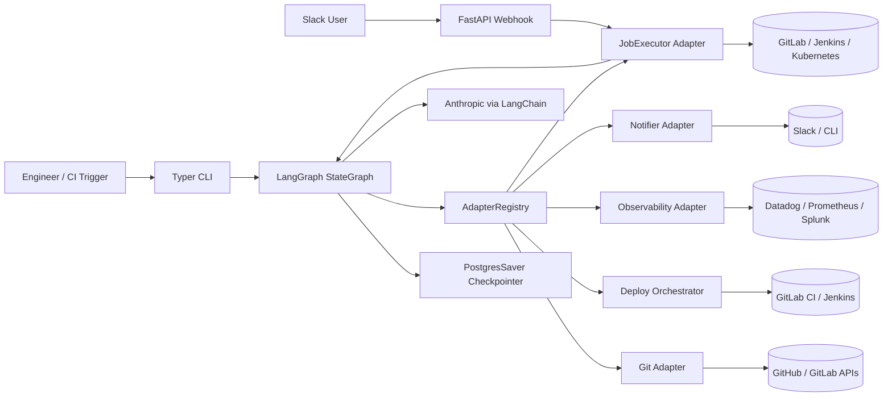
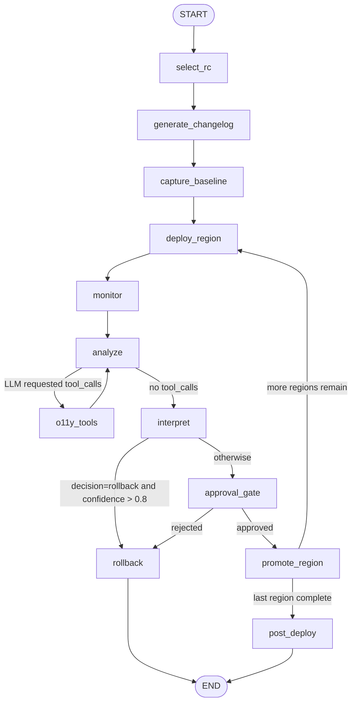
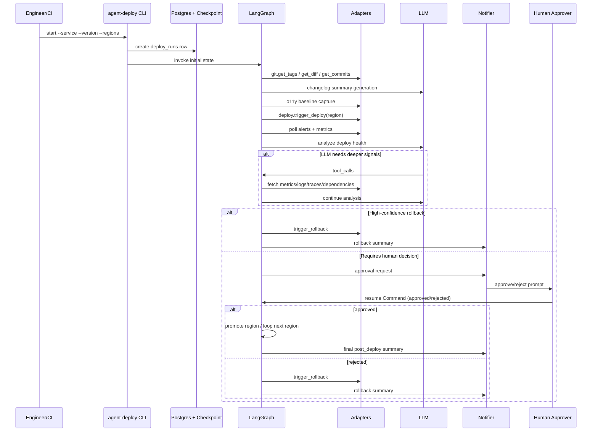

# agent-deploy

Lightweight AI deploy agent for progressive delivery.

`agent-deploy` orchestrates a multi-region deployment lifecycle with:
- LangGraph state-machine control flow
- LLM-based deploy-health analysis
- human approval gates
- rollback routing
- provider adapters for Git, deploy systems, observability, notifications, and job execution

## Table of contents

- [What this project does](#what-this-project-does)
- [Architecture](#architecture)
- [Deployment lifecycle flow](#deployment-lifecycle-flow)
- [Technology stack](#technology-stack)
- [Core concepts](#core-concepts)
- [Repository structure](#repository-structure)
- [Configuration](#configuration)
- [Run locally](#run-locally)
- [CLI reference](#cli-reference)
- [Webhook server](#webhook-server)
- [CI/CD execution model](#cicd-execution-model)
- [Testing](#testing)
- [Extending the system](#extending-the-system)
- [Current implementation notes](#current-implementation-notes)

## What this project does

This system drives deploys through a graph:

1. Select a release candidate (latest tag).
2. Generate a changelog from git diff + commits.
3. Capture pre-deploy baseline metrics/SLOs.
4. Deploy one region.
5. Monitor post-deploy signals.
6. Ask an LLM to analyze health.
7. If needed, let the LLM call observability tools (ReAct loop).
8. Route to approval or rollback.
9. Promote to next region or finish with a final summary.

## Architecture

### High-level component diagram



### Provider matrix

| Capability | Interface | Implementations |
|---|---|---|
| Git metadata/diff/tags | `GitAdapter` | `GitHubAdapter`, `GitLabGitAdapter` |
| Deploy trigger/rollback | `DeployOrchestrator` | `GitLabDeployOrchestrator`, `JenkinsDeployOrchestrator` |
| Observability | `O11yAdapter` | `DatadogAdapter`, `PrometheusAdapter`, `SplunkAdapter` |
| Notifications | `Notifier` | `SlackNotifier`, `CLINotifier` |
| Async job execution | `JobExecutor` | `GitLabExecutor`, `JenkinsExecutor`, `K8sExecutor` |

## Deployment lifecycle flow

### Graph routing diagram



### Sequence diagram (happy path + approval)



## Technology stack

| Area | Technology |
|---|---|
| Language/runtime | Python 3.12 |
| Packaging | `pyproject.toml` + Hatchling |
| Workflow engine | LangGraph |
| LLM integration | LangChain Anthropic (`ChatAnthropic`) |
| HTTP clients/server | `httpx`, `FastAPI`, `uvicorn` |
| Data/config | Pydantic v2 + `pydantic-settings` |
| Persistence | SQLAlchemy 2, PostgreSQL, LangGraph Postgres checkpoint saver |
| CLI UX | Typer + Rich |
| Logging/retries | Structlog + Tenacity |
| Notifications | Slack Bolt |
| Testing | Pytest + pytest-asyncio |
| Optional infra executor | Kubernetes Python client (`agent-deploy[k8s]`) |

## Core concepts

### 1) State-first orchestration

The deploy lifecycle is modeled as a typed `DeployState` dictionary with fields for:
- deploy identity (`deploy_id`, `service`, `version`)
- region progress (`target_regions`, `current_region_index`, `regions_completed`)
- observability evidence (`baseline_snapshot`, `monitoring_snapshots`, `alerts_fired`)
- LLM verdict (`analysis_decision`, `analysis_confidence`, `analysis_reasoning`, `analysis_evidence`)
- control outcomes (`approval_status`, `rollback_needed`, `error_message`)

### 2) ReAct-style analysis loop

The `analyze` node binds tool functions (`fetch_detailed_metrics`, `fetch_error_logs`, `fetch_trace_exemplars`, `check_dependent_services`) so the model can ask for more signals before finalizing a verdict.

### 3) Human-in-the-loop safety

Unless a rollback verdict is high-confidence (`> 0.8`), execution goes through `approval_gate` and interrupts for human input.

### 4) Progressive regional rollout

Each approved region is promoted, then the graph loops to the next region until all targets are completed.

### 5) Adapter-driven portability

Provider choices are runtime configuration, not hardcoded in node logic. This allows swapping Git/deploy/o11y/notification/executor backends.

## Repository structure

```text
src/agent_deploy/
  cli.py                     # Typer entrypoints (start/status/approve/reject/rollback/run)
  config.py                  # Environment-driven settings
  db.py                      # SQLAlchemy models + engine/session helpers
  graph/
    graph.py                 # StateGraph construction + edge routing
    state.py                 # DeployState schema
    nodes/                   # Node implementations
  llm/
    prompts.py               # System prompts
    schemas.py               # AnalysisResult/Evidence schema
    tools.py                 # LLM-callable o11y tools
    context.py               # Prompt context builders
  adapters/
    protocols.py             # Interface contracts
    registry.py              # Provider wiring + singleton registry
    git/                     # GitHub/GitLab adapters
    deploy/                  # GitLab CI/Jenkins deploy orchestrators
    o11y/                    # Datadog/Prometheus/Splunk adapters
    notify/                  # Slack/CLI notifiers
    executor/                # GitLab/Jenkins/K8s job executors
  webhook/server.py          # FastAPI webhook endpoints

tests/                       # Unit tests for graph, nodes, context, analysis routing
ci/Jenkinsfile               # Jenkins pipeline invoking `python -m agent_deploy run`
Dockerfile                   # Multi-stage image build
```

## Configuration

All settings are environment variables prefixed with `AGENT_DEPLOY_`.

### Core

| Variable | Purpose |
|---|---|
| `AGENT_DEPLOY_DATABASE_URL` | SQLAlchemy + LangGraph checkpoint DB |
| `AGENT_DEPLOY_ANTHROPIC_API_KEY` | Anthropic API credential |
| `AGENT_DEPLOY_CLAUDE_MODEL` | Config model name (see notes below on current node usage) |

### Provider selection

| Variable | Allowed values |
|---|---|
| `AGENT_DEPLOY_GIT_PROVIDER` | `github`, `gitlab` |
| `AGENT_DEPLOY_DEPLOY_PROVIDER` | `gitlab`, `jenkins` |
| `AGENT_DEPLOY_O11Y_PROVIDER` | `datadog`, `prometheus`, `splunk` |
| `AGENT_DEPLOY_NOTIFY_PROVIDER` | `slack`, `cli` |
| `AGENT_DEPLOY_EXECUTOR_PROVIDER` | `gitlab`, `jenkins`, `k8s` |

### Provider credentials/endpoints

| Domain | Variables |
|---|---|
| GitHub | `AGENT_DEPLOY_GITHUB_TOKEN`, `AGENT_DEPLOY_GITHUB_OWNER`, `AGENT_DEPLOY_GITHUB_REPO` |
| GitLab | `AGENT_DEPLOY_GITLAB_URL`, `AGENT_DEPLOY_GITLAB_TOKEN`, `AGENT_DEPLOY_GITLAB_PROJECT_ID`, `AGENT_DEPLOY_GITLAB_TRIGGER_TOKEN` |
| Jenkins | `AGENT_DEPLOY_JENKINS_URL`, `AGENT_DEPLOY_JENKINS_USER`, `AGENT_DEPLOY_JENKINS_API_TOKEN`, `AGENT_DEPLOY_JENKINS_DEPLOY_JOB` |
| Datadog | `AGENT_DEPLOY_DATADOG_API_KEY`, `AGENT_DEPLOY_DATADOG_APP_KEY`, `AGENT_DEPLOY_DATADOG_URL` |
| Prometheus | `AGENT_DEPLOY_PROMETHEUS_URL`, `AGENT_DEPLOY_ALERTMANAGER_URL` |
| Splunk | `AGENT_DEPLOY_SPLUNK_URL`, `AGENT_DEPLOY_SPLUNK_TOKEN` |
| Slack | `AGENT_DEPLOY_SLACK_BOT_TOKEN`, `AGENT_DEPLOY_SLACK_SIGNING_SECRET`, `AGENT_DEPLOY_SLACK_CHANNEL` |
| Kubernetes | `AGENT_DEPLOY_K8S_NAMESPACE`, `AGENT_DEPLOY_KUBECONFIG` |

### Behavior tuning

| Variable | Default |
|---|---|
| `AGENT_DEPLOY_BAKE_WINDOW_MINUTES` | `30` |
| `AGENT_DEPLOY_MONITOR_INTERVAL_MINUTES` | `5` |
| `AGENT_DEPLOY_APPROVAL_TIMEOUT_MINUTES` | `120` |
| `AGENT_DEPLOY_APPROVAL_TIMEOUT_ACTION` | `escalate` |
| `AGENT_DEPLOY_MAX_ANALYSIS_TOOL_ROUNDS` | `3` |

## Run locally

### 1) Install

```bash
python3.12 -m venv .venv
source .venv/bin/activate
pip install -e ".[dev]"
```

Optional Kubernetes executor support:

```bash
pip install -e ".[dev,k8s]"
```

### 2) Set environment

Create a `.env` (or export vars in your shell) with at least:

```bash
export AGENT_DEPLOY_DATABASE_URL="postgresql://localhost:5432/agent_deploy"
export AGENT_DEPLOY_ANTHROPIC_API_KEY="..."
export AGENT_DEPLOY_GIT_PROVIDER="github"
export AGENT_DEPLOY_DEPLOY_PROVIDER="gitlab"
export AGENT_DEPLOY_O11Y_PROVIDER="datadog"
export AGENT_DEPLOY_NOTIFY_PROVIDER="cli"
export AGENT_DEPLOY_EXECUTOR_PROVIDER="gitlab"
# plus provider-specific credentials from the table above
```

### 3) Bootstrap DB tables

No migration framework is currently checked in, so initialize schema with SQLAlchemy metadata:

```bash
python - <<'PY'
from agent_deploy.config import AgentDeploySettings
from agent_deploy.db import Base, get_engine

settings = AgentDeploySettings()
engine = get_engine(settings.database_url)
Base.metadata.create_all(engine)
print("Schema created")
PY
```

### 4) Start a deploy

```bash
agent-deploy start \
  --service payments-api \
  --version v1.2.3 \
  --regions us-east-1,eu-west-1
```

### 5) Query status

```bash
agent-deploy status --deploy-id deploy-xxxxxxxxxxxx
```

## CLI reference

| Command | Purpose |
|---|---|
| `agent-deploy start --service --version --regions` | Create a new progressive deploy and invoke graph |
| `agent-deploy status --deploy-id` | Show persisted run metadata |
| `agent-deploy approve --deploy-id --region` | Resume an interrupted approval gate with approved decision |
| `agent-deploy reject --deploy-id --region --reason` | Resume with rejection |
| `agent-deploy rollback --deploy-id` | Force rollback path |
| `agent-deploy run --deploy-id --trigger --resume-data` | CI entry point (`start`, `resume`, `cron`) |

## Webhook server

Run webhook API:

```bash
uvicorn agent_deploy.webhook.server:app --host 0.0.0.0 --port 8000
```

Endpoints:
- `GET /health`
- `POST /slack/actions` for Slack interactive button callbacks
- `POST /webhook/deploy-callback/{deploy_id}` for deploy system completion callbacks

## CI/CD execution model

The graph is designed for resumable execution:

1. `start` run initializes state and persists checkpoints.
2. `resume` run receives decision payload (approval/rejection).
3. `cron`/recovery run continues from latest checkpoint.

`ci/Jenkinsfile` demonstrates this by invoking:

```bash
python -m agent_deploy run \
  --deploy-id "$DEPLOY_ID" \
  --trigger "$TRIGGER_TYPE" \
  --resume-data "$RESUME_DATA"
```

## Testing

Run tests from venv:

```bash
./.venv/bin/pytest -q
```

Current local result in this repository:
- `37 passed`

## Extending the system

### Add a new provider

1. Implement the relevant protocol in `adapters/protocols.py`.
2. Add concrete adapter under the corresponding `adapters/*` folder.
3. Wire provider selection in `adapters/registry.py`.
4. Add settings fields in `config.py` if new credentials are needed.
5. Add tests for adapter behavior and graph-node usage.

### Add a new graph step

1. Create node in `graph/nodes/`.
2. Register node + edges in `graph/graph.py`.
3. Extend `DeployState` if new fields are required.
4. Add routing tests in `tests/test_graph.py` and node tests in `tests/test_nodes.py`.

## Current implementation notes

These points reflect current behavior in code:

1. `start --version` is currently overwritten by `select_rc_node`, which selects the latest git tag.
2. Analysis/changelog/post-deploy nodes currently instantiate `ChatAnthropic` with hardcoded model strings, rather than reading `AGENT_DEPLOY_CLAUDE_MODEL`.
3. `monitor_node` uses internal defaults (`15m` bake, `5m` interval) and does not currently read behavior settings from `AgentDeploySettings`.
4. Slack action payload wiring needs alignment:
   - `SlackNotifier` sends action IDs `deploy_approve` / `deploy_reject`.
   - Webhook handler expects `approve_deploy` / `reject_deploy`.
   - Webhook handler parses `action.value` as JSON with `deploy_id`/`region`, while notifier currently sends plain `deploy_id` string.
